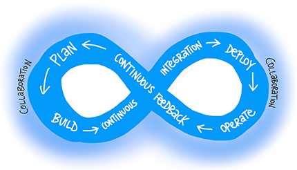
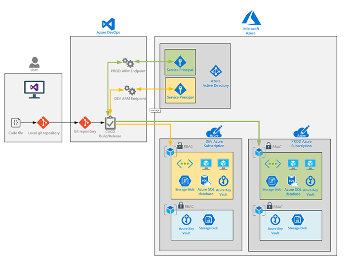
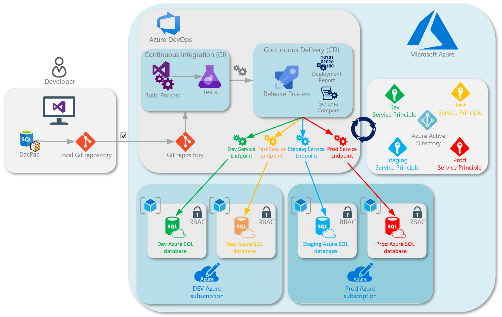

# **Supercharge your Azure SQL deployments by operationalizing Azure with DevOps**
This repository is used for a technical workshop.  It focuses on the skills and technologies needed to learn how to quickly deploy and manage Azure SQL database development and deployments at scale using Azure DevOps Services.  Supercharge your data estate with database lifecycle management using modern cloud principles and architectures.  Learn how to leverage the power of Azure Resource Manager and DevOps to deploy efficiently. Learn how to seamlessly manage database projects and handle schema changes that will avail your cloud migration efforts with ease.

---
##  Learning objective
Learn how to architect, design, and develop a full Azure SQL DB management lifecycle using DevOps. You will learn how to build an end to end solution to deploy the Azure Services along with full CI/CD pipelines to "Rub a little DevOps" on your database development.

---

##   Target role(s)
Architects, consultants, DBAs, database developers, and data professionals in the Data & AI space wanting to learn how to operationalize Azure with DevOps.

##  Workshop Modules

[All modules](/docs/labs/README.md)

1. [Configure your Local Environment](/docs/labs/1-ConfigLocalEnvironment.md)
   1. Install and configure (Git, Visual Studio - SSDT, VS Code, Azure PowerShell, SSMS, Azure Data Studio, SQLPackage.exe)
2. Configure your DevOps Environment
   1. Azure Resource groups
   2. Azure AD Service Principles
   3. Access Control (IAM)
   4. DevOps Service connections - Azure Resource Manager
3. Azure Resource Deployment
   1. Azure DevOps Build - Azure Services
   2. Azure DevOps Release - Azure Services
4. Database Lifecycle Management
   1. SSDT Project
   2. Azure DevOps Build - Database Development
   3. Azure DevOps Release - Database Development
   4. Unit Testing
   5. Dev, Test, Prod Pipeline

##  Prerequisites & References
While there are no prerequisites for this workshop, it is helpful if you have already had some experience and understanding of the following:
- [Overview of SQL Server Data Tools (SSDT)](https://docs.microsoft.com/en-us/sql/ssdt/sql-server-data-tools?view=sql-server-ver15)
- [SqlPackage.exe reference](https://docs.microsoft.com/en-us/sql/tools/sqlpackage?view=sql-server-ver15)
- [Azure Data Architecture Guide](https://docs.microsoft.com/en-us/azure/architecture/data-guide/)
  - [Online analytical processing (OLAP)](https://docs.microsoft.com/en-us/azure/architecture/data-guide/relational-data/online-analytical-processing)
  - [Online transaction processing (OLTP)](https://docs.microsoft.com/en-us/azure/architecture/data-guide/relational-data/online-transaction-processing)
  - [Data warehousing](https://docs.microsoft.com/en-us/azure/architecture/data-guide/relational-data/data-warehousing)
- [Azure Resource Group planning and design](https://docs.microsoft.com/en-us/azure/azure-resource-manager/resource-group-overview)
- [Azure AD and RBAC - Controlling which Azure resources accounts have access to](https://docs.microsoft.com/en-us/azure/role-based-access-control/role-assignments-portal)
- [How to login to an Azure subscription using Azure PowerShell](https://docs.microsoft.com/en-us/powershell/azure/authenticate-azureps?view=azps-3.1.0)
- [Deploying resources into Azure using ARM templates](https://docs.microsoft.com/en-us/azure/azure-resource-manager/resource-group-template-deploy)
- [Git source control framework - Basics of source control and collaborating with others](https://docs.microsoft.com/en-us/azure/devops/learn/git/what-is-git)

##  Scope
This workshop is the distilled and simplified experience of multiple engineers working on migrating data estates for enterprise customers to the cloud.

##  What is Azure SQL Database?
Azure SQL Database is the intelligent, scalable, cloud database as a service in Azure. It is a general-purpose relational database in Azure as a managed service.  It is based on the latest stable version of the Microsoft SQL Server database engine.  To learn about Azure SQL Database please read through the Microsoft Documentation: [Azure SQL Database documentation](https://docs.microsoft.com/en-us/azure/sql-database/)

##  What is Azure DevOps?
Azure DevOps is software as a service that provides developer services to support work item planning, collaborate of code development, and building and deploying applications. This workshop uses Azure DevOps service to operationalize the development and deployment of Azure SQL Database.  The full documentation for Azure DevOps can be reviewed by visiting the Microsoft Docs: [Azure DevOps](https://docs.microsoft.com/en-us/azure/devops/?view=azure-devops).

##  What is DevOps?
“DevOps is the union of people, process, and products to enable continuous delivery of value to our end users.” – Donovan Brown 
 
To learn more about DevOps please vist: What is [DevOps?](https://docs.microsoft.com/en-us/azure/devops/learn/what-is-devops) 
 
To learn the prerequisite skills and technologies needed to succeed with Azure DevOps as the preferred method for deploying applications into Azure please vist: [Azure Superpowers](https://github.com/microsoft/AzureSuperpowers) 

##  What is Database management lifecycle?
 
Database Lifecycle Management (DLM) is an approach to managing databases and data assets using CI/CD. DLM is a comprehensive approach to managing the database schema, data, and metadata for the database(s). A thoughtful and proactive approach to DLM enables an organization to manage data resources according to appropriate levels of performance, protection, availability, and cost. Providing the team the ability to source control their database(s) while supercharging their deployments and development with DevOps. Leveraging SQL Server Data tools to manage database projects and integrate with Git Repositories within Azure DevOps Services.  The team can develop, test, build, deploy, maintain, monitor, and scale with ease.

##  Contributing
This project welcomes contributions and suggestions.  Most contributions require you to agree to a
Contributor License Agreement (CLA) declaring that you have the right to, and actually do, grant us
the rights to use your contribution. For details, visit https://cla.opensource.microsoft.com.

When you submit a pull request, a CLA bot will automatically determine whether you need to provide
a CLA and decorate the PR appropriately (e.g., status check, comment). Simply follow the instructions
provided by the bot. You will only need to do this once across all repos using our CLA.

This project has adopted the [Microsoft Open Source Code of Conduct](https://opensource.microsoft.com/codeofconduct/).
For more information see the [Code of Conduct FAQ](https://opensource.microsoft.com/codeofconduct/faq/) or
contact [opencode@microsoft.com](mailto:opencode@microsoft.com) with any additional questions or comments.
