## Lab 2 - Configure your DevOps Environment
--------------------------------

[Back to all modules](/docs/labs/README.md)

| Lab Description | This lab covers the configurations and environment creation for DevOps deployments. |
| :------------ | :-------------- |
| Estimated Time to Complete | 30 minutes |
| Key Takeaways | 1. Create resource group in Azure  for deployment automation |
|  | 2. Establish RBAC permissions for resource creation |
|  | 3. Setup permissions and service principals for continuous deployments in Azure DevOps environment |
|  | By the end of this lab, you should have: Resource Groups, Service Principal, Azure DevOps Environment, Artifacts needed to complete this workshop
| Author | Shirley MacKay </br> Frank Garofalo|

### Purpose

This lab will create the environment for the CI/CD process. Service Principals are leveraged to allow permission to deploy or update resources in certain environments for a specific purpose. The Service Connection uses a Service Principal's permissions which are based off of RBAC. It gives Administrators better control over their environment while allowing the engineers the ability to focus on their code.
 
 **Summary**
  * [Setup Up Azure Environment](#exercise---setup-azure-environment)
  * [Azure AD Service Principal](#exercise---setup-permissions)
  * [Setup Azure DevOps Environment](#exercise---set-up-azure-devops-environment)
  * [Push files to your Azure DevOps Repo](#exercise---push-files-to-your-repo)

## <div style="color: #107c10">Exercise - Setup Azure Environment</div>

### Create Azure Resource groups

 
> Perform the tasks below either via the **Portal** or **PowerShell**.
> Create two resource groups one for **Dev** and **Prod**
> Example naming convention: (name)-prod, (name)-dev

#### Prerequisites
1. Redeem your **Promo Code** for activating your Azure Subscription, go to the following link: [Click here](https://www.microsoftazurepass.com/Home/HowTo?Length=5)

> #### **Portal**
1. Login to **https://portal.azure.com**
2. Select **Resource Groups** from the main menu

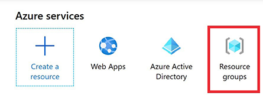

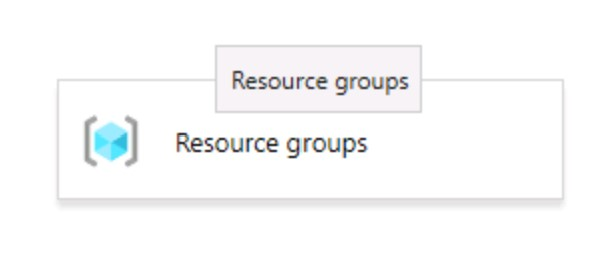

Create resource groups,  **SuperchargeSQL-dev** and **SuperchargeSQL-prod** with the steps below:   
1. Click **+ Add**
   1. Select the **Subscription**
   2. Enter the **Resource Group** name 
   3. Select the **Region**
   4. Click **Review + create**
   5. Click **Create**
2. Click **Refresh** in the portal to see the new resource group

> #### **PowerShell**
:bulb: Recommend using  the **VS Code** IDE for PowerShell script development

Create **SuperchargeSQL-dev** and **SuperchargeSQL-prod** resource groups with the PowerShell Script below: 

1. Open **VS Code**
2. Create a new file
3. Change the default environment to PowerShell. In the bottom corner of **VS Code**, click on "Plain Text" and type "PowerShell"


:exclamation: Execute the script below for each resource group

```powershell

#You only need to use Login-AzAccount once if you use the same session
#IMPORTANT: The signin window may show up BEHIND the application. Minimize windows to view the signin window.
Login-AzAccount #For Azure Government use: #Login-AzAccount -Environment AzureUSGovernment

#For 1st script execution update $rg value with: SuperchargeSQL-dev 
#For 2nd script execution update $rg value with: SuperchargeSQL-prod
$rg = "<Your Resource Group Name>" 

#You can use the following cmdlet to obtain the region (location)
#Get-AzLocation
$location = "<Location>" #Example: eastus2 

#You can use the following cmdlet to obtain the subscription id
#Get-AzSubscription
Select-AzSubscription –Subscription '<Id>'

New-AzResourceGroup -Name $rg -Location $location
Get-AzResourceGroup -Name $rg
```

### Create Service Principal

> Perform the tasks below either via the **Portal** or **PowerShell**. </br>

:bulb: This lab uses one Service Principal. Typically, a Service Principal is used for each environment: Development, Staging, Production. 

> #### **Portal**

1. Login to **https://portal.azure.com**
2. Select **Azure Active Directory** from the main menu or from **More Services**</br>
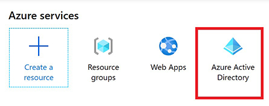

3. Select the **App Registrations** blade
4. Select **+ New registration**
   1. Enter the **Name**: **(your alias)-SuperchargeSQL-SP** 
   1. Leave the defaults
   1. Click **Register**

On the **App Registrations > (Your App Name)** blade
  1. Select the **Certificates & secrets** blade
	   1. Select the **+ New client secret** 
	   1. Enter the **Description**
	   1. Click **Add**
	   1. Copy the **Value**

:exclamation: Copy the new **client secret** value and **Application Id** (Overview blade). You won't be able to retrieve it after you perform another operation or leave this blade. Generate a new secret if it is lost it or expires. We recommend using the portal steps to generate a new client secret.

> #### **PowerShell**

:bulb: Use the below PowerShell script in a PowerShell file with **VS Code**. Make sure to update the parameter values.


```powershell 

#You only need to use Login-AzAccount once if you use the same session
#IMPORTANT: The signin window may show up BEHIND the application. 
Login-AzAccount #For Azure Government use: #Login-AzAccount -Environment AzureUSGovernment

#You can use the following cmdlet to obtain the subscription id
#Get-AzSubscription
Select-AzSubscription –Subscription '<Id>'


$spName  = '(your alias)-SuperchargeSQL-SP'
$id = (New-Guid).Guid
$secret = (New-Guid).Guid

$cred = New-Object Microsoft.Azure.Commands.ActiveDirectory.PSADPasswordCredential
$cred.StartDate = Get-Date
$cred.EndDate = (Get-Date).AddYears(1)
$cred.KeyId = $id
$cred.Password = $secret
New-AzADServicePrincipal -DisplayName $spName -PasswordCredential $cred

#IMPORTANT: Save the value for $secret, it will be used later
$secret 
```

:exclamation: Copy and save the Service Principal Name, Application Id and Secret. You won't be able to retrieve it after you perform another operation or leave this blade. Generate a new secret if it is lost it or expires. We recommend using the portal steps to generate a new client secret.


## <div style="color: #107c10">Exercise - Setup Permissions</div>

### Access Control (IAM) for the Resource Group(s)

```powershell
# Perform the tasks below either via the Azure Portal or PowerShell via VS Code.
```
> #### **Portal**

:exclamation: Do these steps for both of the resource groups you created:  

For each of the resource groups that you created earlier

1. Go to the resource group
2. Click on the **Access control (IAM)** blade
3. Click on **+ Add**
4. Click on **Add role assignment**
     1. Select the **Owner** role
     2. Enter your Service Principal name in the **Select** box to search
     3. Click **Save**
5. Click on **Role Assignments** to verify

> #### **PowerShell**

:exclamation:  Use the below PowerShell Script in a PowerShell file in **VS Code**, executing it twice, once for each of your resource group names. Make sure to update the parameter values

```powershell  

> *Note:* you only need to use Login-AzAccount once if you use the same session
Login-AzAccount #For Azure Government use: #Login-AzAccount -Environment AzureUSGovernment

#Note!: To view your subscription you can run: Get-AzSubscription
Select-AzSubscription –Subscription '<Id>'

#For 1st script execution update $rg value with: SuperchargeSQL-dev 
#For 2nd script execution update $rg value with: SuperchargeSQL-prod
$spName  = '<Service Principal Name>'
$rg = "<Your Resource Group Name>"

$app = (Get-AzADServicePrincipal -DisplayName $spName).ApplicationID
New-AzRoleAssignment -ApplicationID $app -ResourceGroupName $rg -RoleDefinitionName 'Owner'

```

## <div style="color: #107c10">Exercise - Setup Azure DevOps Environment</div>


#### Azure DevOps Organizations

1. Sign in **https://dev.azure.com/**
2. Navigate to Azure DevOps after signing in
3. Click on **New Organization**
     1. Confirm and Enter an **organization** name
         *  The organization name is a DNS name therefor it must be globally unique.  
     2. Choose a **Location**
4. After creation, navigate to your organization **https://dev.azure.com/{yourorganization}**


#### Azure DevOps Project - Clone Project Repo
1. Enter your **Project name**
2. Enter Description (optional)
3. Select **Private**
4. Expand the Advanced options
5. Select **Git** and **Basic** for version control and work item process, respectively. 
6. Click on **+ Create project**

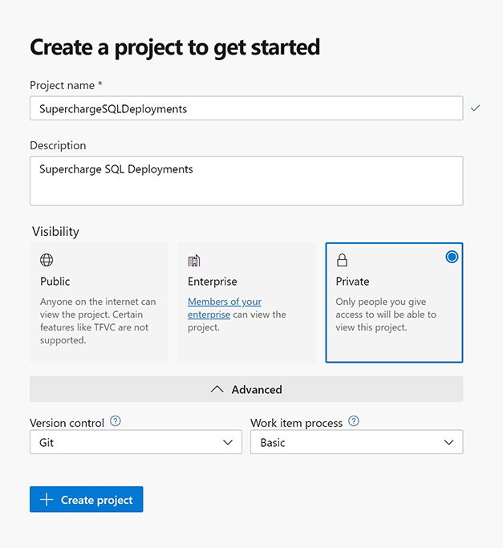

1. Click on **Repos**

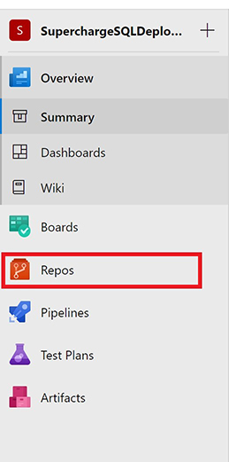

1. Click on **Initialize**</br>
*Defult settings to include Add a README*


## Branching
There are many options for a branching strategy and Git gives you the flexibility in how you use version control to share and manage code.  It's an important part of DevOps and your strategy is something that your team should come up with.  For more information about branching strategies please review [Adopt a Git branching stategy](https://docs.microsoft.com/en-us/azure/devops/repos/git/git-branching-guidance?view=azure-devops) docs page. For this workshop we are going to work with just a *dev* and *master* branch.

1. Click on Repos to expand the **Repos** sub menu
2. Click on sub menu **Branches**</br>
     *Notice that your Repo only has a **master** branch, by default new Git Repos only have a **master** branch*</br>

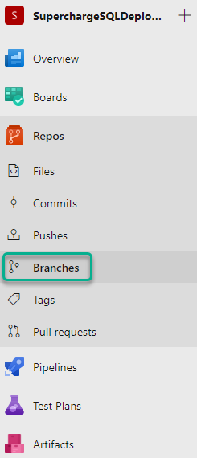

3. Click **New branch** 
4. Enter Name: **dev**
5. Click **Create**
6. Click on the ellipse on the **master** branch to expose more options
7. Click **Branch policies**
   


8. You are now going to set a policy to Protect your **master** branch</br>
*This is to keep people from accidentally checking dev code into master/prod branch*
1. Select **Require a minimum number of reviewers**
2.  Change the minimum number of reviewers to **1**
3.  Select **Requestors can approve their own changes**
4.  Save changes

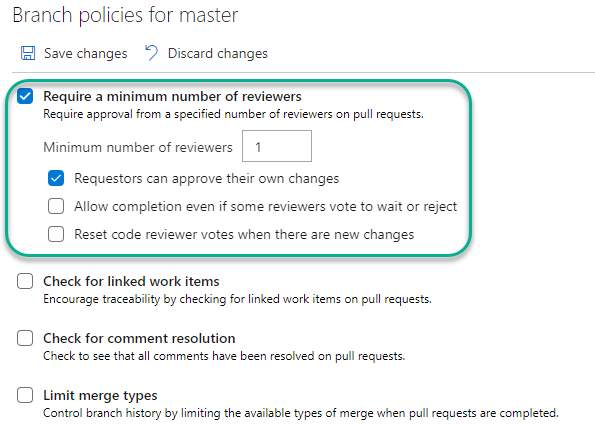

1. Click on **Branches**
2. Notice that your master branch, now has a Branch Policy icon on it. 

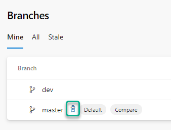

## DevOps Service Connection with Azure Resource Manager

1. Select the **Project Settings**

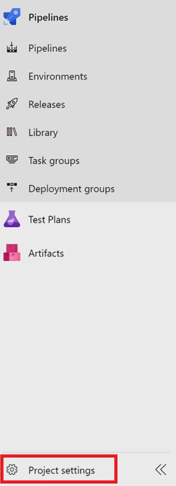

2. Select **Service Connections** under **Pipelines**
3. Click on **+ New service connection**
4. Select **Azure Resource Manager**
5. CLick on **use the full version of the service connection dialog**

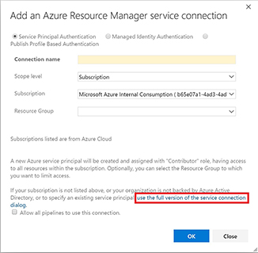

>  If you do not use the full version, Azure DevOps will attempt to use your currently logged in Azure DevOps credentials to create a new Service Principal and give it rights to the subscription, instead of using the one we just created.  We do not want our service connection to have rights to everything in our subscription.

Enter the following:

1. Enter **Service connection name**: \Supercharge SQL Service Connection
2. Select Environment
3. Select Scope level **Subscription**
4. Enter **Subscription Id**</br>
     ```PowerShell
     Get-AzSubscription
     #Returns Subscription Name, Id, TenantId and State
    ```
5. Enter **Subscription Name**
6. Enter **Service Principal client ID** (Created earlier)
7. Select Credential **Service principal key**
8. Enter **Service principal key** (Value noted earlier)
9. Tenant ID: should be pre-populated
10. Click on **Verify**
13. Click on **OK**

## <div style="color: #107c10">Exercise - Push files to your Repo</div>
Your repository is currently empty, except for the default README.md file that was created to initialize your repo. In this exercise you are going to use Git commands to clone down the source files needed for this lab and push them up to your repo.  

1. Using the TERMINAL in VS Code or Git Bash
2. Run the following Git command to clone this Github Repo</br>

```Bash

git clone https://github.com/microsoft/SuperchargeAzureSQLDeployments.git c:/SuperchargeAzureSQL

```
3. In a browser navagate to your Azure DevOps Project that you created above.
   1. Click on **Repos**
   2. Click **Files**
   3. Click the **Clone** button

</br>

1. Copy the Command line **HTTPS** URL for your repo by clicking on the copy icon

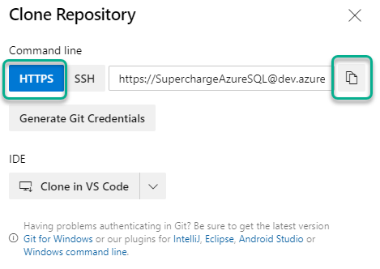

2. Back in VS Code hit the F1 key to open the command pallet
3. Type **Git: Clone** and hit enter
4. Paste the Repository URL for your Azure DevOps Repo
5. Navigate to your **C:\\** drive
6. CLick **Select Repository Location**
   1.  You may be asked to provide your Microsoft account
   2.  Use your Microsoft account used to login to Azure DevOps
7.  Using windows explore navigate to the the **source** directory in the cloned GitHub repo
    *  **C:\\SuperchargeAzureSQL\\source\\** </br>

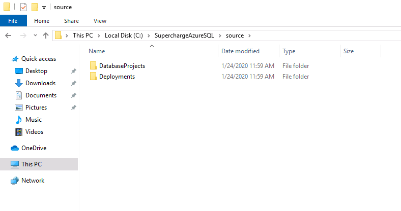

8.  Copy both directories:  DatabaseProjects & Deployments
9.  Using windows explore navigate to your cloned Azure DevOps repo
    *  **C:\\SuperchargeSQLDeployment** </br>
10. Paste the copied directories from step 11 into your cloned Azure DevOps repo
11. The above steps should result with the following:


## Performing your initial Commit using VS Code

1. In VS Code from the menu click **File** > **Open Folder** 
2. Navigate to your Cloned Azure DevOps Repo: **C:\SuperchargeSQLDeployments**
3. Click on the Git icon from the left side menu
   1. Notice that is shows a number on the icon
   2. This is the number file files that have not been committed to your local Git repository for your Azure DevOps project
4. Make sure your our working off of the Dev branch
   1. Click on **master** from the bottom left of VS Code</br>


   2. Select **dev**</br>
      1. If you haven’t previously selected the dev branch you may need to choose **origin/dev**

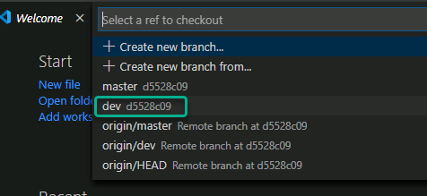

   3. You should now be in your *dev* branch</br>
   


5. Click on the + that shows up when you hover over **CHANGES**
   * This will **stage** all changes in your repo to be committed
   * You can also pick and choose which files you want to stage, for this workshop we want all of the initial files staged to be committed</br>

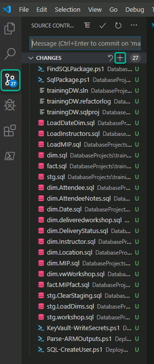

6. Type a message for the initial commit in the **Message** box (ie. initial commit)
7. Click the Check mark to perform the commit.
  >If you receive an error message **Make sure you configure your 'user.name' and 'user.email' in git.** Click Cancel on the error message </br>
  > 1. Open the Terminal in VS Code
  > 2. Run the following commands, **filling in your own name and email address**
  ><br/>
  >git config --global user.name "Your Name" <br/>
  >git config --global user.email "you@example.com" <br/>
  >
  > 3. Run your commit again (Step 6.)
7. You now have commited all of the changes to your local Git Repo, notice that the Git icon in the left side menu does not show any numbers. 
8. Notice that you have changes to push up to your remote Git repo (Azure DevOps Repo</br>


1. Click on the **sync** icon in the bottom left to perform a Git pull & Git push
     * You can also run the following Git command
     >git push
2.  Using a browser navigate to your Azure DevOps project
3.  Click on **Repos** > **Files**
4.  You should now see all of the files in your repo
    1. You may need to select the ‘dev’ branch to see the new files


___     
- [Next Lab](/docs/labs/3-AzureResourceDeployment.md)
- [Back to all modules](/docs/labs/README.md)
___
___
**Azure subscriptions**

<ins>TRIAL SUBSCRIPTIONS ARE NOT SUPPORTED FOR THIS WORKSHOP</ins>
