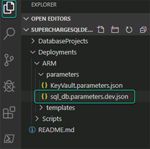
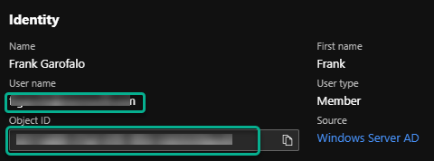
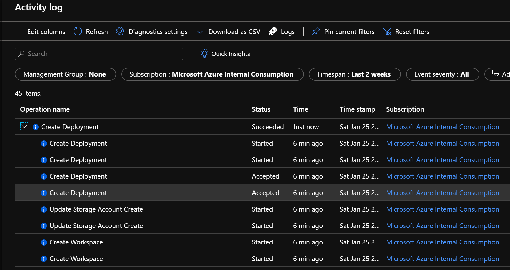
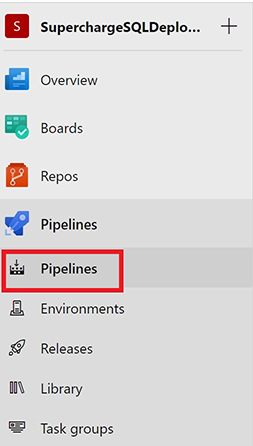
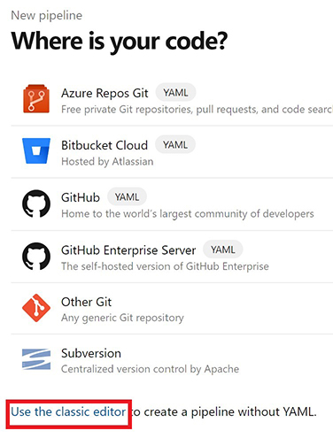
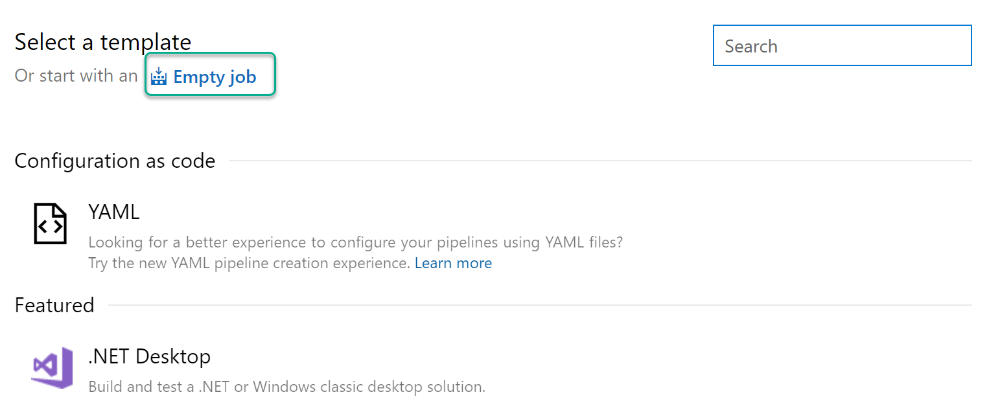

## Lab 3 - Deploy Azure Resouces
--------------------------------

[Back to all modules](/docs/labs/README.md)

| Lab Description:            | This lab covers all the steps needed to deploy Azure Resource with Azure DevOps pipelines.   |
| :------------              | :--------------       |
| Estimated Time to Complete: | 25 minutes            |
| Key Takeaways:              | 1. Understand Adanvced ARM templates |
|                            | 2. Create CI/CD pipelines            |
|                            | By the end of this lab, you should have an understanding of: advanced ARM templates, how create build and release pipelines, how to deploy Azure Resources with DevOps         |
| Author(s):                     | Frank Garofalo             |

### Purpose
This lab is to build your foundational knowledge of how to leverage Azure DevOps to deploy Azure Resource with CI/CD pipelines.  This lab walks you through advanced ARM templates showing you how you can have an end state configuration for your Azure resource to limit the need to do post deployment configuration. You will create both a build and release pipeline which covers the CI/CD portions of DevOps.

 **Summary**
  * [Review Adanced ARM templates]({summerylinke})
  * [{summary link}]({summerylinke})
  * [{summary link}]({summerylinke})

## <div style="color: #107c10">Exercise - Advanced ARM template</div>

### Lunch VS Code

1. Open **sql_db.json** file
   1. Located in: **Deployments** > **ARM** > **templates**</br>


1. Review lines **180 - 196** there are multiple example of how you can use functions in ARM templates to control behavior and maybe your deployments dynamic.
2. Review lines **376** - **410**, these resources are examples of how you can create multiple Firewall Range rules and/or vNet Firewall rules using copy index and a parameter array
3. Review lines **411** & **486** this is an example of how to use copy index to deploy mulitiple databases with the option of diffent skus for each DB  

   1. Also note that this resource uses a nested resource to perform some other configurestions on each database like: ensure TDE is enabled, auditing is configured, and Security Alert Policies are set
   
4.  This ARM templete can be used to be deploy: Storage account, Log Anylitics, SQL Logtical Server, and multiple SQL DB(s). </br>

>You may see older schema versions this is becuase the templete is designed to work in both Azure Commerical and Azure Government

6.  Close **sql_db.json** without saving anything

#### Edit parameter file

1.  Open **sql_db.parameter.dev.json** file
    1.  Located in: **Deploymnets** > **ARM** > **parameter** </br>



1. Befor makeing any changes to the parameter file spend some time reviewing it and reading through all of the comments.
   1. Each parameter has comments to help provide you with context of the value needed
   2. For this workshop you will only need to updated the values we call out, but are free to test other values outside of the workshop.

2. Enter name for **serverName**, line **27**
   1.  The server name needs to be gloabally unique
   2.  Recommend using: **\<alias>-sqlsrv-dev** (ie jdoe-sqlsrv-dev) </br>


4. Enter **serverADAdminGroup** at line **29** and **serverADAdminSID** at line **39**
   1. You can look up these values in Azure AD </br>

 </br>

</br>

1. Enter **emailAddress ** at line **162**

>Email address for where you want Security Alerts and Vulnerability Assessment scans sent.


1. Save and close **sql_db.parameter.dev.json** file

#### Test deployment with PowerShell

1. Click **File** > **New File** or keyoard shortcut: *Ctrl + N*
2. Set File format to PowerShell


3. Run the following to test your ARM deployment with PowerShell

```PowerShell
Login-AzAccount
#For Azure Government use:  
#Login-AzAccount -Environment AzureUSGovernment

#Select the correct Subscription
Select-AzSubscription –Subscription '<Id>'

$params = @{
    ResourceGroupName = '<enter your RG name>' #Dev Resource Group from lab 2
    TemplateFile = '.\DLM\AzureSQLDB\Deployments\ARM\templates\sql_db.json'
    TemplateParameterFile = '.\DLM\AzureSQLDB\Deployments\ARM\parameters\sql_db.parameters.dev.json'
    Verbose = $true
}
#Test ARM deployment
Test-AzResourceGroupDeployment @params 
```
Expended Result
> VERBOSE: time ran - Template is valid.

4. Run the following to deploy your ARM template with PowerShell
   
```PowerShell
$params = @{
    ResourceGroupName = '<enter your RG name>' #Dev Resource Group from lab 2
    TemplateFile = '.\DLM\AzureSQLDB\Deployments\ARM\templates\sql_db.json'
    TemplateParameterFile = '.\DLM\AzureSQLDB\Deployments\ARM\parameters\sql_db.parameters.dev.json'
    Verbose = $true
}

#Deploy ARM template
New-AzResourceGroupDeployment @params

#To Check Resources Deployed Run:
Get-AzResource -ResourceGroupName "dlm-demo-dev" | Format-Table

```
5. You can check the status of your deployment from the protal
   1. Log into: [portal.azure.com](https:/portal.azure.com)
   2. Navagate to the Resource Group you deployed to
   3. Click on **Deployments** blade
   4. Click on **Related events** to view details about the deployment




6. Once deployment completes check that all resource deployed


1. Close **Untitled-1** PowerShell file, no need to save
2. **Stage** & **Commit** any changes to your repo
3. **Sync** or **Push** your changes to your remote branch (Azure DevOps Repo)

## <div style="color: #107c10">Exercise - Build Pipeline (CI)</div>

In this exrcise you will walk through all of the steps needed to create the Continuous integration (CI) portion of your Azure Resource deployment. This step is called the build proccess.  You will test that your ARM templete build corretly. 

1. In a browser window navagate to your DevOps project
2. Navigate to **Pipelines**
3. Click on **Pipelines**



3. Click on **Create Pipeline**
4. Click on **Use the classic editor to create a pipeline without YAML**



5. Select a source
     1. Select **Azure Repos Git**
     2. Select the **Team project**
     3. Select **Repository**
     4. Select **dev** for Default branch for manual and scheduled builds
     5. Click on **Continue**
     


1. Select **Empty Job** at the top of the list



2. Update **Name** to: **Dev - DLM Azure Resources-CI**
3. Leave defaults for **Agent Pool** & **Agent Specification**


4. Click on Agent job 1
5. Update **Display Name** to: **Publish Deployment Artifacts**
6. Keep all other defaults


7. Click the + next to **Publish Deploymnet Artifacts**
8. Search for **Azure resource group** 
9. Click **Add** on the **Azure resource group deployment** task


10. Click on the newly added **Azure resource group deployment** task and perform the following:
    1.  Update **Display name**: Validate Deployment ARM Templates for SQL DB
    2.  Select **Azure subscription** - You should see your Azure Service Connection that you setup earlier when configuring your DevOps environment.
    3.  **Action**: **Create or update resource group**
    4.  **Resource group**: Select your dev resource group that was setup in the pervious lab
    5.  **Location**: Select the location you used for your resource group
    6.  **Template location**: Linked artifact
    7.  **Template**: click on the ellipses and navagate to the **sql_db.json** template file to select it.
    8.  