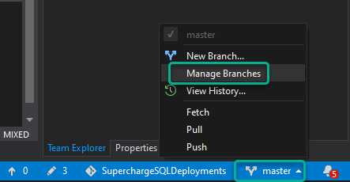
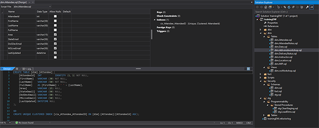
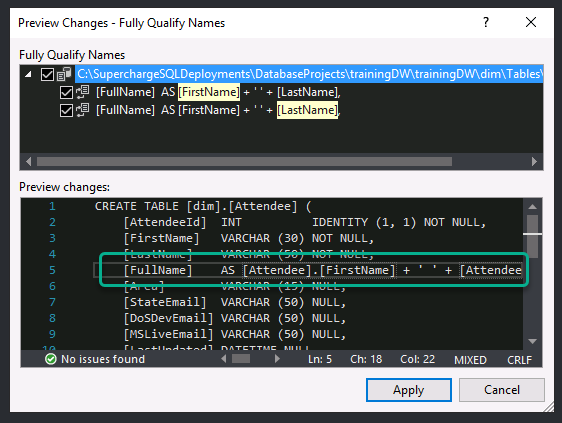
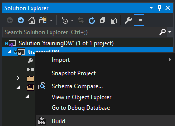

## Lab 4 - Database life cycle management (DLM)
--------------------------------

[Back to all modules](/docs/labs/README.md)

[comment]: <> (Lab header table provide values for lab)

| Lab Description:            | This lab covers all the steps needed to deploy Azure Resource with Azure DevOps pipelines.   |
| :------------               | :--------------              |
| Estimated Time to Complete: | 60                          |
| Key Takeaways:              |By the end of this lab, you should have an understanding of: SSDT DB Projects, How create build and release pipelines to deploy schema changes, Database Unit Testing, and leverage the power of sqlpackage.exe    |
| Author(s):                     | Frank Garofalo             |

[comment]: <> (Write up purpose for this lab, provide some info on the what and why) 
### Purpose

The purpose of this lab is to take the skils you have learned so far and apply them to Database life cycle management (DLM). This lab walks you through the concepts of a database project in Visual Studio, how to setup and use a CI/CD process for rapid development, unit testing and change control.  

 **Summary**
  * [{summary link}]({summerylinke})
  * [{summary link}]({summerylinke})
  * [{summary link}]({summerylinke})

[comment]: <> (Main Exercise format) 
## 
Exercise - Review SSDT database project

In this exercise you are going to review a database project for a simple database.  

### Initial SSDT project setup
 
1. Launch Visual Studio 2019
   1. If this is the first time launching Visual Studio it may ask you to sign in. If you have an MSDN account we recommend signing in. If not feel free to select *Not now, maybe later.* 
   2. You may also be asked pick development Settings and a color theme.  We recommend General and the theme of your choice. 
2. Click on **Open a project or solution**
3. Navigate to: **C:\SuperchargeSQLDeployments\DatabaseProjects\trainingDW**
4. Select the solution file: **trainingDW.sln**
5. Click on **master** in the bottom right corner > **Manage Branches**
   

6. Expand **remotes/origin** > select **dev** (you may need to dbl click to select it)
   1. **dev** should now be in your local Git dir

:bulb: Just like in VS Code you want to be developing and editing in your **dev** branch.  **Master** only gets updated from pull requests.

### Get to know SSDT database projects
1. In the **Solution Explorer** right click on **trainingDW** > **Properties**
   1. From here you can set and configure settings for your project
   2. Notice your **Target platform:** is set to **Microsoft Azure SQL Database**
   3. Click on the arrow to view other Target platforms available (leave it as Azure SQL DB)
2. Click on the **Database Settings...** button

   
3. Click through the **Common**, **Operational**, and **Miscellaneous** tabs
   1. Notice that **Database collation** is the only setting you can change. This is because your target platform is set to **Microsoft Azure SQL Database**
   2. Spend a couple minutes changing the Target Platform and then reviewing the **Database Settings...** that are available to configure
   3. Make sure to set **Target platform:** back to **Microsoft Azure SQL Database**
4. Close the **trainingDW Project Setting**
5. In the **Solution Explorer** expand **trainingDW**
6. Expand folder **dim**
   1. Notice the folder structure: Tables, Views
   2. Database projects are designed to work in a folder structure to organize your schema, similar to what you see via SSMS
   3. Expand **dim** > **Tables**
   4. Notice how each file is named: **schema.tableName.sql** (each database object is stored as a SQL script)
   5. Click on **dim.Attendee.sql** to open it.
   6. Spend a minute to review (you can edit in the designer or T-SQL)

7. Close **dim.Attendee.sql**
8. Right click on **dim.Attendee.sql** > Hover over Refactor

9. Note the options you can use to refractor your scripts
10. Click on **Fully-qualify Names..**
11. Review how this option can quickly refactor your script to use *Fully Qualified Names*
12. Click **Cancel**

13. From the main Visual Studio menu bar click **View** > **SQL Server Object Explorer**

14. Expand **Projects - trainingDW** > **Tables** > Right click on: **dim.Attendee**
15. Hover over **Refactor**
16. Notice you have additional refactoring options
    1.  Feel free to click through each to see how they work (**do not apply the changes**)

17. Close any open windows
18. Open file: **trainingDW.refactorlog** from **Solution Explorer**
    1.  Note that all refactored changes are logged and can be reviewed. This is a nice option to have if you need to check what changed in your database quickly from the last deployment.
    2.  Close **trainingDW.refactorlog**

### Build your database project

1. From the **Solution Explorer** right click on **trainingDW** > Click on **Build**

2. Expected Result

   

___     
- [Next Lab](/docs/labs/{enter next labe .md})
- [Back to all modules](/docs/labs/README.md)
___
___
**Azure subscriptions**

<ins>TRIAL SUBSCRIPTIONS ARE NOT SUPPORTED FOR THIS WORKSHOP</ins>